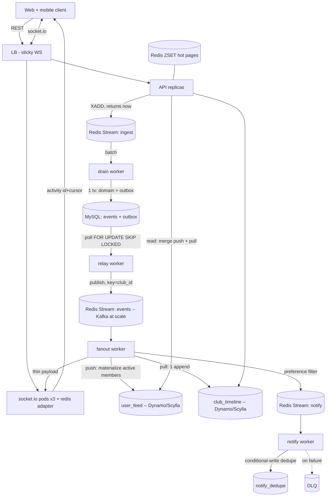
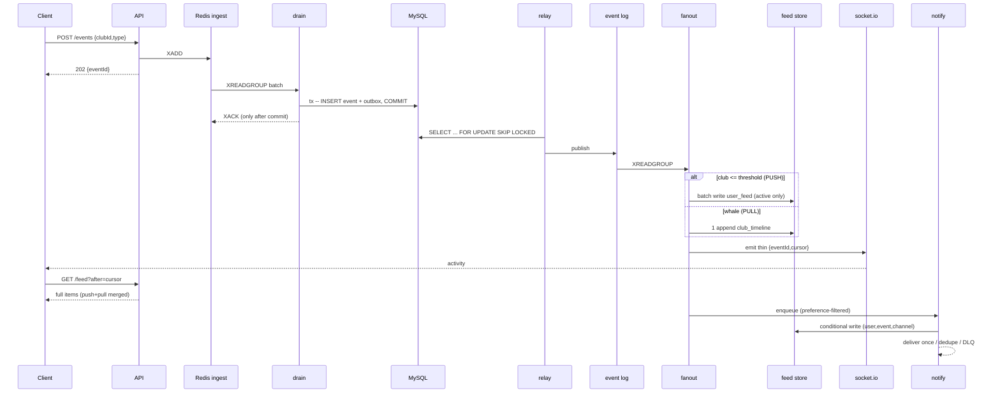

# Club Activity Feed — System Design (one page)

> The one-page deliverable. A runnable implementation of this design lives in
> this repo (`README.md`); every box below is built and load-tested.

**Design in one breath.** Events are accepted onto a Redis Streams **ingest buffer**
in O(1) and the request returns immediately (never touches the DB on the write
path — the spike absorber). A **drain** worker persists each event with its
**outbox row in one MySQL transaction**, ACKing the buffer only after commit
(no loss window). A **relay** polls the outbox (`FOR UPDATE SKIP LOCKED`) and
publishes to the event log. A **fanout** worker then splits on club size:
**push** (materialize per-user feeds) for small clubs, **pull** (one append to a
day-bucketed club timeline, merged at read time) for whale clubs up to 500k —
and only ever touches users **active in the last N days** (a Redis set
intersection). It pushes a **thin realtime payload** (id + cursor) to the club's
socket room and enqueues **preference-filtered** notifications, deduplicated
exactly-once at the sink by a conditional write on `(user, event, channel)`.

Chosen from tech I've run in production; each has a documented scale swap:
**Redis Streams → Kafka** (outbox keeps it a localized swap), **DynamoDB →
ScyllaDB** (identical key schema), **Compose → k8s Deployments + HPA**.

## Component diagram



## Sequence — event fired → fanned out → feed + notification



## API sketch

**HTTP (OpenAPI 3, abbreviated):**

```yaml
paths:
  /events:               # ingest — buffered, returns immediately
    post:
      requestBody: { clubId: string, type: EventType, text?: string }
      responses: { 202: { accepted: true, eventId: ulid } }
  /feed:                 # push/pull merged, cursor pagination
    get:
      parameters: [userId, limit, before?, after?]   # before=older, after=backfill
      responses: { 200: { items: FeedItem[], nextCursor: ulid|null, hasMore: bool } }
  /preferences:          # per-user channel prefs
    get:  { 200: Preferences }
    put:  { requestBody: Preferences, 200: Preferences }
components:
  EventType: [member_join, match_start, poll_open, announcement]
  FeedItem:     { id: ulid, eventId: ulid, clubId, clubName, type: EventType,
                  actorId, actorName, text, createdAt: int64, via: [push,pull] }
  Preferences:  { userId, inApp: bool, email: bool, push: bool, mutedClubs: string[] }
```

**Realtime (socket.io):** client `join {userId, clubIds[]}` → server
`activity {eventId, cursor, clubId, type, createdAt}` (thin; client backfills body via `/feed?after=`).

**Bus message (Protobuf, the event-log record — Kafka-native at scale):**

```proto
message ActivityEvent {
  string id = 1;            // ULID: ordering + cursor + feed sort key
  string club_id = 2;       // partition key
  EventType type = 3;
  string actor_id = 4; string actor_name = 5;
  string club_name = 6; string text = 7;
  int64  created_at = 8;    // epoch ms, stamped at ingest
  int32  member_count = 9;  // snapshot -> fanout decides push/pull without a DB hit
}
```

## Frontend note (all-stack)

**WebSockets**, not polling — a poll loop at this fanout would hammer the read
path, and SSE loses the cheap client→server `join`. The socket carries only a
**thin cursor**; the client **backfills the body through the REST read path**, so
one query serves both first-load and live updates. **Reconnection/backfill:** on
connect *and* reconnect the client calls `GET /feed?after=<newestCursor>` before
resuming, so a dropped socket never drops an event. **Consistency:** ULID cursors
give one global order; items insert by cursor (dedup by id), infinite scroll pages
backward with `before`; if scrolled down, live items queue behind a "N new" pill.
Same REST+WS contract serves web and mobile; native push maps to the `push` channel.

## AI-agent implementation

Lean on agents for **mechanical breadth**: scaffolding shared contracts (types,
Redis keys, table schemas) once and generating the services, the React shell, the
Compose wiring, and the load generator against them. Don't hand them the
**correctness-critical seams** unsupervised — ACK-after-commit in drain, the
`SKIP LOCKED` relay, the conditional-write dedupe — write those deliberately.
Keep quality under control by making correctness **measurable**: a load generator
that fails if duplicates or lost events are ever non-zero holds the guarantee no
matter what the agent refactors underneath.

## Guarantees & scale

Exactly-once (idempotent sinks: ULID-keyed feed writes + conditional-write notify
dedupe) and no-loss (transactional outbox + ACK-after-commit) are **proven by a
load generator that reports duplicates and lost events — both 0**. Per-club
ordering via ULID + `club_id` partition. The 5k/s-avg, 20k/s-peak targets are met
by design through partition-by-`club_id` + horizontally scaled workers/pods
(Kafka + Scylla at scale); the demo proves the *mechanism and the guarantees* hold
under load and that latency drops as workers are added.
