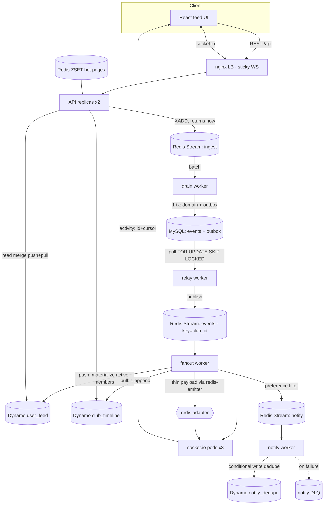
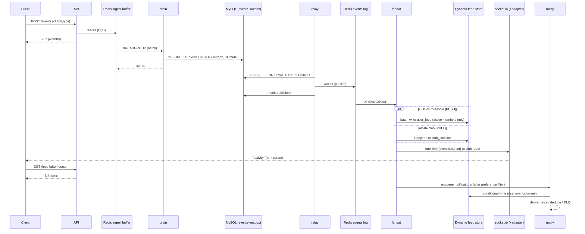

# Chess.com Club Activity Feed — working demo

A runnable, horizontally-scalable implementation of the "Club Activity Feed"
assignment: when something happens in a club (member joins, team match starts,
poll opens, announcement), it shows up near-real-time in every member's feed —
web + mobile — and optionally fires a notification per the member's preferences.

The hard part is scale: **~5k events/sec average, ~20k/sec peak, a single event
fanning out to up to ~500k members**, feeds that feel instant, and notifications
that are **never lost or duplicated**. This repo builds the whole path end-to-end
so the design decisions are *studyable by doing* — including a load generator
whose headline output is a counter that proves **zero loss and zero duplication
under load**.

> Built from tech I've run in production (React, Node, Redis, DynamoDB, WebSockets).
> Every choice has a documented **swap** — for scale (Redis Streams→Kafka,
> dynamodb-local→ScyllaDB) or to align with Chess.com's platform
> (Node→PHP/Symfony, React→Vue, ECS→k8s). The outbox + read-model boundaries keep
> each swap localized. See [§ Swaps at scale](#swaps-at-scale).

> 📄 **The one-page design deliverable is [`DESIGN.md`](./DESIGN.md)** — component
> diagram, sequence flow, API sketch (OpenAPI + Protobuf), frontend note, AI-agent
> note. This README is the deep-dive / run guide behind it.

> ⚠️ **Real vs. designed:** the core pipeline and its guarantees are implemented and
> load-tested end-to-end; several refinements in the design (notification digesting,
> cache read-throughs, DLQ policy) are **designed but not yet wired**. Honest status
> and TODOs are in [§ Implemented vs. designed](#implemented-vs-designed-honest-status--todos).

---

## TL;DR — run it

```bash
make up                      # build + start everything (first run pulls images)
# open http://localhost:8080  → the chess.com-style UI, click "Simulate event"

make load RATE=8000 SECONDS=30 CLUB=whale   # spike a 500k-member club
# watch the report: buffer depth absorbs the spike, DUPLICATES=0, LOST=0
```

Everything runs in Docker Compose: 3 socket.io pods, 2 API replicas, 4 worker
types, Redis, MySQL, dynamodb-local, and an nginx LB with sticky WebSocket
sessions. Scale any worker: `docker compose up -d --scale fanout=3 --scale drain=2`.

---

## What's in the box

| Layer | Tech (local) | Role |
|---|---|---|
| Frontend | React + TS + Vite | chess.com-style shell, cursor infinite-scroll feed, live socket updates + REST backfill |
| Edge | nginx | LB: round-robin API, **sticky** socket.io, static SPA |
| Realtime | socket.io ×3 pods + `@socket.io/redis-adapter` | one room per `club:{id}`, cross-pod broadcast |
| API | Node + TS + Express (×2) | stateless: ingest, feed reads, preference CRUD, metrics |
| Write buffer | Redis Streams (`stream:ingest`) | O(1) pipeline buffer — **the spike absorber** |
| Durable core | MySQL | domain rows + **transactional outbox** |
| Event log | Redis Streams (`stream:events`) | partitioned by `club_id`; **Kafka at scale** |
| Feed store | dynamodb-local | `user_feed` (push) + `club_timeline` (pull); **ScyllaDB at scale** |
| Notifications | Redis Streams + Dynamo conditional write | separate consumer group, **exactly-once**, DLQ |
| Cache | Redis sorted sets | hot-feed pages, `noeviction` |

---

## Implemented vs. designed (honest status & TODOs)

The design (see [`DESIGN.md`](./DESIGN.md)) is a bit ahead of the code. The **core
pipeline and its guarantees are fully implemented and load-tested**; several
optimizations and hardening steps are **designed but not yet wired**. Calling this
out explicitly so nothing here reads as more finished than it is.

**✅ Implemented & verified end-to-end**
- Write path: `POST /events` → Redis ingest buffer → **drain** (event + outbox in one
  MySQL tx, `XACK` after commit) → **relay** (`FOR UPDATE SKIP LOCKED` → publish) → **fanout**.
- Fanout: **always** appends `club_timeline` (authoritative log) **+** materializes
  `user_feed` for **active** members of push clubs (Redis `SINTER`).
- Read path: **push/pull merge** (`user_feed` + each club's `club_timeline`), dedupe,
  cursor pagination (`before`/`after`). Inactive-member completeness **verified**.
- Realtime: **3 socket.io pods + Redis adapter**, thin payload, client REST backfill.
- Notifications: preference-filtered enqueue, **exactly-once** dedupe (conditional
  write on `(user, event, channel)`), separate consumer group + DLQ.
- Guarantees: **load generator proves 0 lost / 0 duplicate** under load; buffer-depth /
  drain-rate / e2e-latency metrics. Docker Compose (3 rt · 2 api · workers · nginx LB).
- Frontend: chess.com-style feed, infinite scroll, live updates, simulate-event, live guarantees widget.

**🚧 Designed but NOT yet implemented (TODOs)**
1. **Hot-page ZSET cache is write-only.** Fanout populates `cache:feed:{user}`, but the
   read path queries DynamoDB directly. *TODO: `ZREVRANGE`-first read-through + Dynamo fallback + warm-on-miss.*
2. **Notification digesting is design-only.** The code enqueues one immediate notification
   per (active member × event). *TODO: `HINCRBY` digest counters + due-set ZSET + scheduler +
   "N new in {club}" summaries + the high-priority/immediate bypass.*
3. **Notification audience is a simplification.** The code notifies only **active** members;
   push/email should reach **preference-enabled members regardless of activity** (bounded by
   digesting). *TODO: split feed-materialization audience (active) from notification audience (preference-enabled).*
4. **`user:{id}:clubs` cache not built.** The feed read resolves the user's clubs via a MySQL
   join. *TODO: cache-aside in Redis + invalidate on join/leave.*
5. **Preferences read-through missing.** Prefs are write-through cached; on a cache miss
   fanout applies a default instead of reading MySQL. *TODO: read-through on miss.*
6. **DLQ policy is naive.** The notify worker DLQs on **any** delivery failure. *TODO: circuit
   breaker + transient (hold/retry) vs. permanent (DLQ) classification + an idempotency-key-with-status
   reaper for the claim-then-crash gap.*
7. **Read path over-merges.** It merges **every** club's timeline each read (correct but not
   read-efficient). *TODO: activity-aware read — serve active users from `user_feed`/cache, merge
   only pull timelines, reconstruct on return.*
8. **Per-club whale timeline cache not built** (one shared cache entry for all members of a hot
   club — the biggest read-offload for whales). *TODO.*
9. **Delivery is simulated.** `deliver()` is a no-op; no real APNs / FCM / SES.

**Intentional demo substitutions** (documented swaps, not gaps): Redis Streams *is* the
event log (Kafka at scale); dynamodb-local *is* the feed store (managed DynamoDB / ScyllaDB
at scale); Docker Compose *is* the orchestration (ECS/k8s + autoscaling at scale). The
`ACTIVE_SAMPLE` env bounds the active set so a "500k" whale runs on a laptop while exercising
the exact production code path.

---

## Architecture



### Sequence — "event fired → feed + notification"



---

## The core decisions (what to look at)

### 1. Whale-club path first — push vs pull
The easy case is **push**: materialize a copy of the event into every member's
`user_feed`. That's fine for small clubs but catastrophic for a 500k-member whale
(one event → 500k writes). So the fanout worker (`server/src/workers/fanout.ts`):

- **always** appends **one** row to `club_timeline` (day-bucketed) — the
  **complete, authoritative per-club log**.
- **additionally**, for **PUSH** clubs (`memberCount <= PUSH_THRESHOLD`, default 5k),
  materializes per-user rows into the `user_feed` of **active** members — a hot
  read cache giving a single-partition read.
- **PULL** (whale) clubs are never materialized; readers merge the timeline.

The read path (`getFeedPage`) reads `user_feed` (fast path) **and merges each
club's `club_timeline`** for completeness, deduping with the materialized copy
winning. It tags each row `via: push` (served from the cache) or `via: pull`
(reconstructed from the timeline) — the UI provenance pill shows which.

**Why always write the timeline?** It's what makes the active-set optimization
(next) *sound*: any feed we skip materializing — inactive members, whale clubs —
is reconstructable from the timeline, so **no member ever misses an event**. It
also closes the threshold-crossing gap (a club growing past 5k). `user_feed` is a
rebuildable cache; `club_timeline` + `events` are the truth.

### 2. Only *materialize* active users — the highest-ROI optimization
Feed **materialization** only touches **users active in the last N days** — a
single Redis set intersection (`SINTER club:{id}:members active:users`). For a
whale this collapses 500k → the active few. This is sound *because* the timeline
is the complete log (decision #1): inactive users are reconstructed on return, so
skipping their materialization never loses data. See `activeMembersOf()` in
`fanout.ts`. (`ACTIVE_SAMPLE` sizes this set in the demo so a laptop can run a
"500k" club; the *code path* is exactly the production one.)

Note the demo also gates *notifications* on the active set for simplicity — but
that's a conflation: push/email exist to reach **inactive** users, so
notifications should target **preference-enabled** members regardless of activity,
with **digesting** to bound volume (see decision #5). Feed materialization =
active-gated; notifications = preference-gated.

### 3. The spike absorber — never touch the DB on the request path
`POST /events` does an O(1) `XADD` to `stream:ingest` and returns immediately
(club metadata comes from a Redis hash, not MySQL). The **drain worker** persists
asynchronously in batches. Under a 20k/sec peak the request path stays flat while
the buffer depth rises and drains — visible live as `bufferDepth` in
`/api/metrics` and the load report. → `server/src/api/index.ts`, `workers/drain.ts`

### 4. No-loss guarantee — transactional outbox + ordered ACK
Two independent safety nets:
- The **drain worker writes the domain row and the outbox row in ONE MySQL
  transaction**, then ACKs the buffer entry **only after commit** ("write DB
  first, then remove from buffer" — the fix to the loss window). A crash mid-batch
  leaves entries pending; they're redelivered (`XAUTOCLAIM`) and re-applied
  idempotently (`INSERT IGNORE`).
- The **relay worker** polls the outbox with `FOR UPDATE SKIP LOCKED` (many
  replicas, zero double-claim), publishes to the event log, then marks published.

### 5. Exactly-once notifications
- **Preference filter before fanout** (cheapest reducer): muted clubs and
  disabled channels are dropped before anything is enqueued. → `shared/prefs.ts`
- **Dedupe at the sink**: the notify worker does a **conditional write** on the
  unique key `(user_id, event_id, channel)` in `notify_dedupe`. The winner
  delivers; every redelivery is a no-op. This is the claim-race fix — redelivery
  from at-least-once upstream can never produce a duplicate notification.
- **Separate consumer group + DLQ** so notification delivery failures never block
  the feed path.
- **Digesting bounds the fan-out** (design; not in the demo code). Rather than one
  notification per event, fanout does an O(1) `HINCRBY digest:{user}:{club}` and a
  **digest scheduler** flushes each window into a single summary — *"50 new
  activities in Team USA"* — so volume is **users × windows**, not **users ×
  events**. High-priority event types bypass for immediate delivery; each digest is
  keyed `(user, club, window)` so the same dedupe + DLQ apply. This is how
  notifications can reach *all* preference-enabled members (incl. inactive) without
  spamming. See `DESIGN.md` for the diagrams.

### 6. Realtime — thin payload, client backfills
Fanout pushes only `{eventId, cursor, clubId, createdAt}` to the club room (via
`@socket.io/redis-emitter`, so a *worker* can broadcast across all pods through
the same redis adapter). The client inserts by cursor and **backfills the body
through the REST read path** (`GET /feed?after=cursor`). On reconnect it does the
same `after`-cursor backfill, then resumes the stream — no gaps, no full objects
on the wire.

---

## Guarantees, made observable

The load generator (`server/src/loadgen/index.ts`) is both a **producer** (fires
`RATE` events/sec at a club) and a **consumer** (a socket.io client in the club
room). Because it sees every event it fired come back over the realtime path, it
computes the guarantees with no trust required:

```
── GUARANTEES ────────────────────────────────
DUPLICATES         0  ✅ (zero duplication)
LOST               0  ✅ (zero loss)
```

It also prints buffer depth, drain rate, end-to-end latency (`now − createdAt`),
and the server-side counters (`notify deduped` proves the exactly-once path is
actually firing under redelivery). The same counters render live in the UI's
"Live guarantees" widget.

```bash
make load RATE=8000 SECONDS=30 CLUB=whale   # whale = PULL path
make load RATE=3000 SECONDS=20 CLUB=small   # small = PUSH path
```

### What's proven vs. what scales to target

Be precise about the claim: this demo **proves the mechanism and the guarantees**
— zero loss, zero duplication, spike absorbed by the buffer, latency dropping as
workers scale — not the literal 20k/s number. A single load-generator process
tops out around ~1k/s (Node `fetch` client-side, not a pipeline limit). The
**5k/s-avg, 20k/s-peak targets are met by design**: partition the log by
`club_id`, run the ingest/drain/fanout/notify workers and socket.io pods at N
replicas (the consumer groups split the load), and swap Redis Streams → Kafka and
DynamoDB → ScyllaDB for the throughput/retention headroom. To push higher load
locally, run several load generators in parallel or `--scale` the workers — you'll
watch buffer depth rise and drain while duplicates/lost stay at 0.

---

<a name="swaps-at-scale"></a>
## Swaps at scale (the cheat sheet)

Everything here is deliberately swappable. The point of the demo is that the
*shape* is production-correct; only the managed backing service changes.

- **Redis Streams → Kafka.** `stream:ingest`, `stream:events`, `stream:notify` are
  consumer-group logs with `XACK`/`XAUTOCLAIM` — the exact semantics of Kafka
  consumer groups + rebalancing. Partition key is `club_id` (ordering per club).
  The **transactional outbox keeps this swappable**: nothing publishes to the log
  except the relay, so replacing the relay's `XADD` with a Kafka produce (or
  Debezium CDC off the outbox table) is a localized change. Redis Streams is the
  right call up to a point; Kafka is the drop-in when throughput/retention/replay
  outgrow a single Redis.
- **dynamodb-local → ScyllaDB (or DynamoDB).** `user_feed` (PK `USER#id`, SK
  ULID, TTL, capped) and `club_timeline` (PK `CLUB#id#day`, SK ULID) map 1:1 to
  Scylla wide-partition tables. Key schema, day-bucketing, and TTL are identical;
  only the driver changes. A wide-column store (Scylla/Cassandra) fits the write
  volume + p99; on AWS it's a config-only swap to managed DynamoDB.
- **MySQL → same MySQL, bigger.** The durable core + outbox is intentionally
  boring and relational. Shard by `club_id` if the write path outgrows one
  primary; the outbox pattern is shard-local.
- **Redis (single) → Redis Cluster, with the dedupe/idempotency instance on
  `noeviction`.** LRU eviction on the dedupe keys would let a redelivery slip
  through as a duplicate, so that instance must never evict.
- **Docker Compose → ECS/Fargate (what I've run) or k8s (Chess.com's platform).**
  Each compose service becomes a Deployment/Service with autoscaling (queue-depth /
  CPU — scale the WS tier on **connection count**, not CPU); the LB becomes an
  ingress/ALB with sticky sessions; Redis/MySQL/Scylla are managed/operated. The
  compose topology maps 1:1 either way.
- **Platform-fit alignment (Chess.com stack).** These services are Node/TS and the
  client is React because that's what I've run in production — the architecture is
  language-agnostic, so the natural alignment is **Node → PHP/Symfony** and
  **React → Vue**. The design (streams, outbox, push/pull, dedupe) is unchanged; it
  just lives in your framework's handlers. The Docker/observability surface maps to
  your **k8s + telemetry/dashboards** workflow.

---

## API sketch

REST (`/api`, behind the LB):

| Method | Path | Purpose |
|---|---|---|
| POST | `/events` | ingest `{clubId,type,text?}` → `202 {eventId}` (buffered, returns now) |
| GET | `/feed?userId&limit&before&after` | push/pull merged page → `{items, nextCursor, hasMore}` |
| GET | `/clubs` | `[{id,name,memberCount,kind}]` |
| GET | `/me` | current demo user + clubIds |
| GET/PUT | `/preferences` | per-user channel prefs + muted clubs |
| GET | `/metrics` | live counters + buffer depth (the observability surface) |

Realtime (socket.io, same origin): client emits `join {userId, clubIds}`; server
emits `activity {eventId, cursor, clubId, type, createdAt}` (thin).

`FeedItem = { id(ULID/cursor), eventId, clubId, clubName, type, actorId, actorName,
text, createdAt, via: 'push'|'pull' }`

---

## Frontend note (all-stack)

The client uses **WebSockets** (socket.io) for liveness, not polling — a poll loop
at this fanout would hammer the read path, and SSE gives up the cheap client→server
`join`. The socket carries only a **thin cursor**; the client **backfills the body
through the REST read path**, so the same cache/query serves both first-load and
live updates (one code path to keep consistent). **Reconnection/backfill**: on
connect *and* reconnect the client calls `GET /feed?after=<newestCursor>` before
resuming the stream, so a dropped socket never drops an event. **UI consistency**:
ULID cursors give a single global order; new items insert by cursor (dedup by id),
and infinite scroll pages backward with `before`. If the user has scrolled down,
live items queue behind a "N new" pill instead of yanking the viewport.

## AI-agent implementation note

I'd lean on agents for the **mechanical breadth**: scaffolding the shared
contracts (types, Redis keys, table schemas) once and generating the services
against them, the React shell, the compose wiring, and the load generator. I would
*not* hand them the **correctness-critical seams** unsupervised — the ACK-after-commit
ordering in drain, the `FOR UPDATE SKIP LOCKED` relay, and the conditional-write
dedupe are where the design earns its keep, so those get written deliberately and
guarded by the observable invariant. The way you keep quality under control is to
make correctness **measurable**: a load generator that fails CI if duplicates or
lost events are ever non-zero is worth more than any amount of code review, because
it holds the guarantee no matter what the agent refactors underneath it.

---

## Layout

```
server/                Node+TS — one image, many roles (tsx, no build step)
  src/shared/          config, types, keys, redis/mysql/dynamo clients, ids, prefs, consumer loop
  src/api/             Express: ingest, feed (push/pull merge), prefs, metrics
  src/workers/         drain · relay · fanout · notify
  src/realtime/        socket.io pod (+ redis adapter)
  src/loadgen/         producer+consumer load test (prints the guarantees)
  src/seed.ts          clubs, memberships, active sets, feed history
web/                   React+TS+Vite chess.com-style UI
infra/nginx/lb.conf    edge LB (sticky WS)
docker-compose.yml     3 rt pods · 2 api · workers · redis · mysql · dynamodb · lb
Makefile               up / down / load / scale / logs
```

## Tuning knobs (`.env`)

`PUSH_THRESHOLD` (push/pull cutoff) · `ACTIVE_SAMPLE` (active-set size) ·
`WHALE_MEMBERS` · `DRAIN_BATCH` / `RELAY_BATCH` / `RELAY_POLL_MS` ·
`LOAD_RATE` / `LOAD_SECONDS` / `LOAD_CLUB`.
